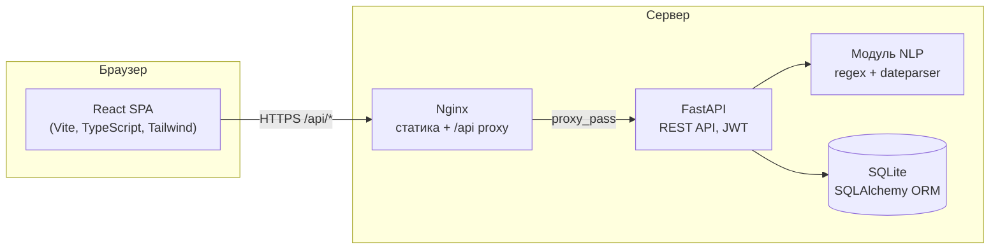
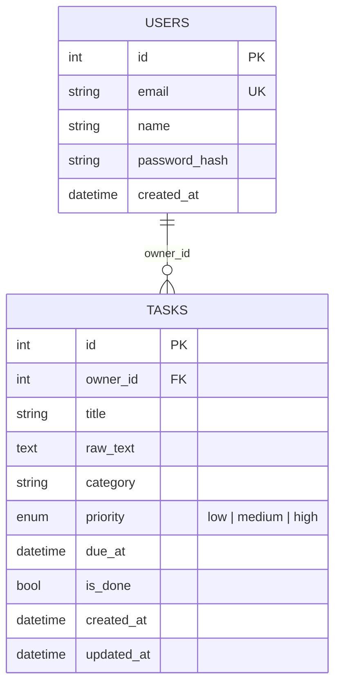

# Архитектура

## Общая схема



В режиме разработки Nginx заменяет dev-сервер Vite, который проксирует `/api` на `uvicorn` (порт 8471).
В production оба сервиса собираются в Docker-образы и поднимаются через `docker-compose`.

## Слои бэкенда

```
backend/app/
├── main.py        # создание FastAPI-приложения, CORS, подключение роутеров
├── config.py      # настройки через переменные окружения (pydantic-settings)
├── database.py    # engine, сессии, базовый класс моделей
├── models.py      # ORM-модели User, Task
├── schemas.py     # Pydantic-схемы запросов/ответов
├── auth.py        # хэширование паролей (bcrypt), выдача и проверка JWT
├── nlp.py         # извлечение даты/времени из текста задачи
└── routers/
    ├── auth.py    # /api/auth/*
    └── tasks.py   # /api/tasks/*
```

## Схема базы данных



`raw_text` хранит исходную фразу пользователя, `title` — очищенное от даты название.
Это позволяет показать преподавателю, что именно распознал парсер, и отлаживать его на реальных данных.

## Как работает «умный» разбор даты

Модуль `nlp.py` работает каскадом, каждый шаг вырезает распознанный фрагмент из текста:

1. **Явная дата** регуляркой: `30.09`, `30.09.2026`, `1/10`. Если год не указан и дата уже прошла — берётся следующий год.
2. **Явное время**: `в 15:00`, `в 7 вечера`, `к 12 дня`, `10 утра`. Слова «утра/дня/вечера/ночи» переводят 12-часовой формат в 24-часовой. Фраза «через 2 дня» специально исключена — это интервал, а не время.
3. **День недели** в любом падеже с предлогом: `в пятницу`, `до понедельника`, `к четвергу`. Берётся ближайший будущий день.
4. **Часть дня** без точного времени: `утром` → 09:00, `днём` → 13:00, `вечером` → 18:00, `ночью` → 23:00.
5. **Остаток** отдаётся библиотеке `dateparser` (язык `ru`, предпочтение будущих дат): она закрывает `завтра`, `послезавтра`, `через неделю`, `через 2 дня`, `5 октября`. Результат с неправдоподобным годом отбрасывается.
6. Если найдено только время и оно уже прошло — задача переносится на завтра.

Что осталось от текста после вырезания фрагментов — становится названием задачи.

## REST API

Все эндпоинты, кроме `register`/`login`/`health`, требуют заголовок `Authorization: Bearer <jwt>`.

| Метод | Путь | Описание |
|---|---|---|
| `POST` | `/api/auth/register` | Регистрация: `{email, name, password}` → токен + пользователь |
| `POST` | `/api/auth/login` | Вход: `{email, password}` → токен + пользователь |
| `GET` | `/api/auth/me` | Текущий пользователь |
| `POST` | `/api/tasks/parse` | Предпросмотр разбора: `{text}` → `{title, due_at, matched[]}` |
| `GET` | `/api/tasks` | Список задач. Параметры: `scope` (`all/today/overdue/upcoming/done/no_date`), `category`, `priority`, `search` |
| `POST` | `/api/tasks` | Создать: `{text, category?, priority?, due_at?}`. Дата из текста извлекается автоматически; явный `due_at` имеет приоритет |
| `GET` | `/api/tasks/stats` | Счётчики: всего / выполнено / просрочено / на сегодня |
| `GET` | `/api/tasks/categories` | Список категорий пользователя |
| `GET` | `/api/tasks/{id}` | Одна задача |
| `PATCH` | `/api/tasks/{id}` | Частичное обновление: `title, category, priority, due_at, clear_due, is_done` |
| `POST` | `/api/tasks/{id}/toggle` | Переключить выполнено / не выполнено |
| `DELETE` | `/api/tasks/{id}` | Удалить |
| `GET` | `/api/health` | Проверка живости |

Интерактивная документация (Swagger UI) доступна на `/docs` при запущенном бэкенде.

## Безопасность

- Пароли хранятся как bcrypt-хэши.
- JWT (HS256) с истечением; секрет задаётся переменной `SMART_TODO_SECRET_KEY`.
- Все запросы к задачам фильтруются по `owner_id` — чужие задачи возвращают 404.
- CORS ограничен списком origin из настроек.

## Технологический стек и обоснование

| Слой | Выбор | Почему |
|---|---|---|
| Backend | Python 3.12, FastAPI | Автогенерация OpenAPI, Pydantic-валидация, минимум кода |
| ORM/БД | SQLAlchemy 2 + SQLite | Ноль настройки для учебного проекта; смена на PostgreSQL — одна строка `DATABASE_URL` |
| NLP | dateparser + регулярные выражения | Готовая поддержка русского языка без обучения моделей |
| Frontend | React 19, TypeScript, Vite, Tailwind 4 | Быстрая сборка, типобезопасность, утилитарные стили |
| Тесты | pytest + httpx TestClient | 28 тестов на API и парсер |
| CI | GitHub Actions | Тесты, линт, сборка образов при каждом push |
| Деплой | Docker + docker-compose + Nginx | Один `docker compose up` на любом сервере |
